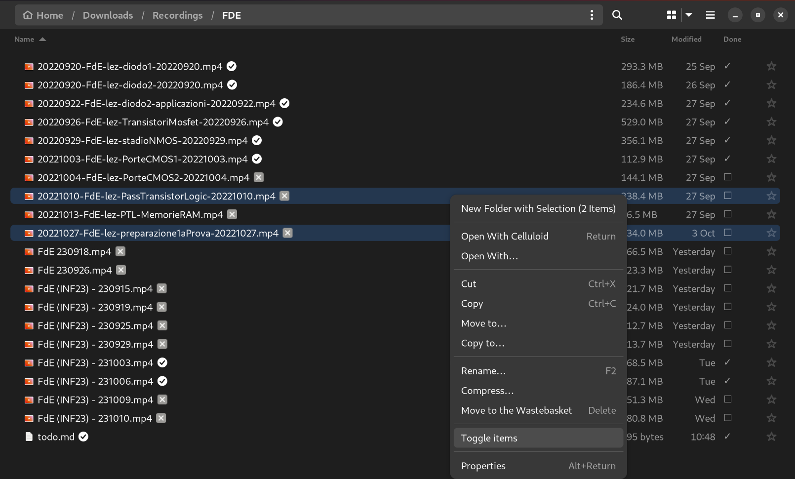

# Todo Nautilus File Manager Integration

This Python script provides an extension for the Nautilus file manager, allowing users to mark files as "done" by managing a to-do list file named "todo.md" in the same directory as the file. It utilizes checkboxes to indicate the status of the task associated with each file.

## Usage 

1. Clone or download this repository.
2. Copy the `task_done_extension.py` file to the appropriate Nautilus extensions directory (usually `~/.local/share/nautilus-python/extensions/`).
3. Give the extension executable permissions by running `chmod +x task_done_extension.py` in the terminal.
4. Restart Nautilus by running `nautilus -q` in the terminal.

## Features

### Task Status Column

A new column named "Done" is added to the file view, indicating whether the associated task is done or not. The column displays a checkmark (✔) for done tasks and an empty checkbox (☐) for pending tasks.

### Toggle Task Status

- Right-click on one or more files in Nautilus.
- Select "Toggle item" or "Toggle items" from the context menu to mark the selected file(s) as done or undone.

## Implementation Details

The extension utilizes the Nautilus extension API and integrates with the Nautilus file manager to provide the mentioned features. It parses the file paths, checks for the presence of a "todo.md" file, and updates the file icons and the "Done" column accordingly based on the task status.

### Files

- `todo_nautilus_extension.py`: Contains the main extension logic and integrates with Nautilus to provide the functionality.

## Note

This extension assumes the existence of a "todo.md" file in the same directory as the file being examined. The extension considers a task associated with a file as "done" if the file name is found in the "todo.md" file.

For any issues or improvements, feel free to open an issue or submit a pull request.

Enjoy managing your file-related-tasks efficiently with Nautilus!

## Screenshots

